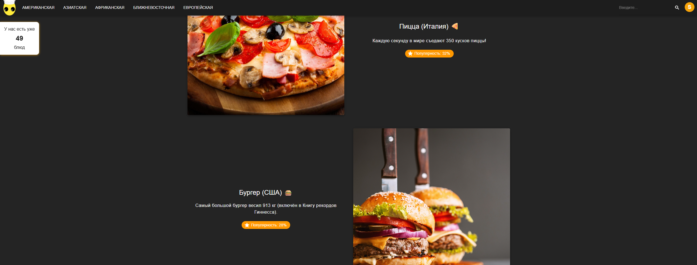
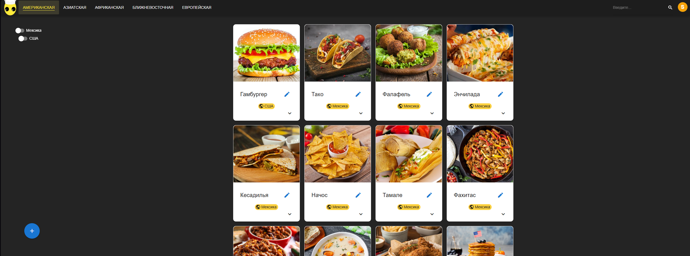
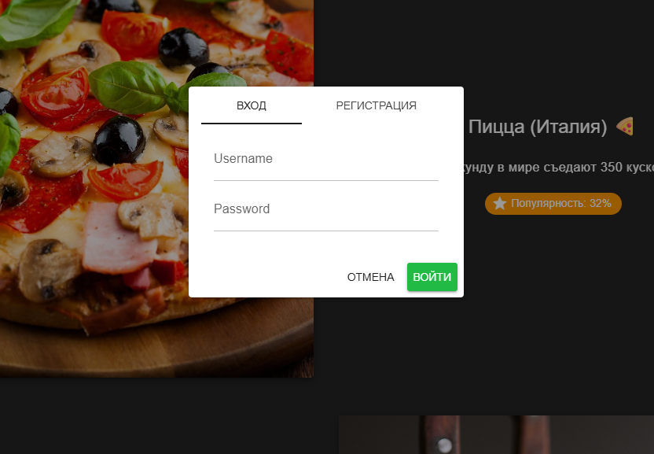
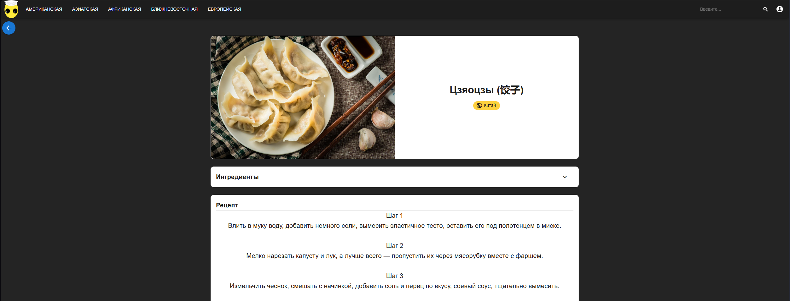
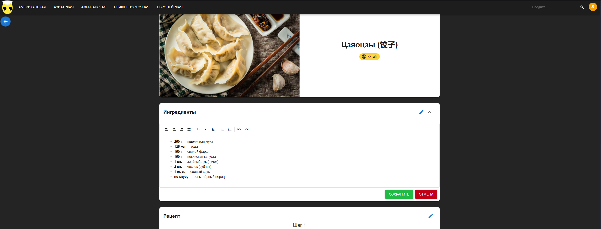
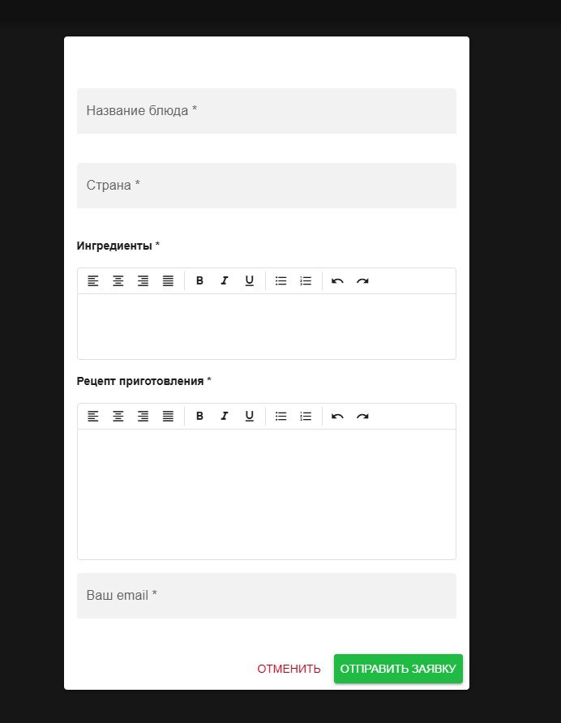
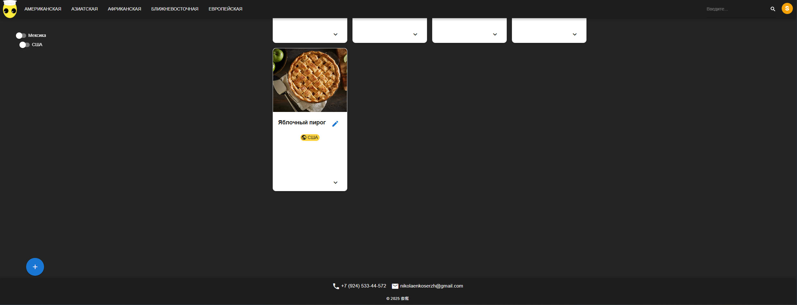

# Кулинарный Блог

Веб-приложение для поиска, просмотра и обмена рецептами с различных культурных пластов.

### Скриншоты приложения:

#### Вступительный экран

*Главная страница с популярными блюдами мира и статистикой рецептов*

#### Культурные пласты

*Страница американской кухни с рецептами блюд*

#### Регистрация и авторизация профиля

*Окно регистрации и авторизация*

#### Детали рецепта

*Страница с подробной информацией о рецепте*

#### Редактирование рецепта

*Возможность редкатирования ингридиентов и рецепта через сайт*

#### Добавление рецепта

*Возможность рецепт блюда через сайт*

#### Контакты

*Внизу страницы контакты*

## 🚀 Технологии

### Backend
- Node.js - среда выполнения JavaScript
- Express.js - веб-фреймворк
- MySQL - реляционная база данных
- Sequelize - ORM для работы с БД

### Frontend
- Vue.js 3 - прогрессивный JavaScript-фреймворк
- Vue Router - маршрутизация
- Quasar - UI-фреймворк
- Axios - HTTP-клиент

## 🗄️ База данных

### Настройка MySQL через XAMPP:

1. Запустите XAMPP:
   - Откройте XAMPP Control Panel
   - Запустите Apache и MySQL

2. Создайте базу данных:
   - Откройте http://localhost/phpmyadmin
   - Создайте новую базу данных с именем culinary_blog

3. Импортируйте схему:
   - Используйте SQL-файл

### Основные сущности:
- users - пользователи системы
- food_name - рецепты блюд
- culture_plasts - культурные пласты/категории

## 🔌 API Endpoints

### Пользователи
- GET /api/user - просмотр всех пользователей
- GET /api/user/:id - просмотр пользователя по ID
- POST /api/adduser - регистрация пользователя
- POST /api/user/login - вход пользователя

### Рецепты
- GET /api/food_name - просмотр всех рецептов
- POST /api/addfood - добавление рецепта
- PUT /api/updatedfood_name/:id - редактирование рецепта
- GET /api/food_name/culture_plast_id/:culture_plast_id - рецепты по культурному пласту
- GET /api/food_name/food/:food - поиск рецепта по названию
- GET /api/food/:id - просмотр рецепта по ID

### Культурные пласты
- GET /api/culture_plasts - просмотр всех категорий

## 🎯 Функциональность

### Для всех пользователей:
- 📋 Просмотр рецептов
- 🔍 Поиск по названию блюд
- 🏷️ Фильтрация по культурным пластам
- 👀 Просмотр детальной информации о рецептах

### Для авторизованных пользователей:
- ➕ Добавление новых рецептов
- ✏️ Редактирование существующих рецептов
- 👤 Управление профилем

## 🎨 Интерфейс

### Основные компоненты:
- Navbar - навигационная панель с поиском и категориями
- Home - главная страница с популярными рецептами
- ProfilePage - страница профиля пользователя
- FoodDetailsPage - детальная страница рецепта
- SearchFood - страница результатов поиска

### Особенности UI:
- Адаптивный дизайн
- Темная тема
- Интуитивная навигация
- Визуально привлекательное оформление

## 🚀 Установка и запуск
- cd backend
- npm install
- npm start

- cd frontend
- npm install
- npm run dev
